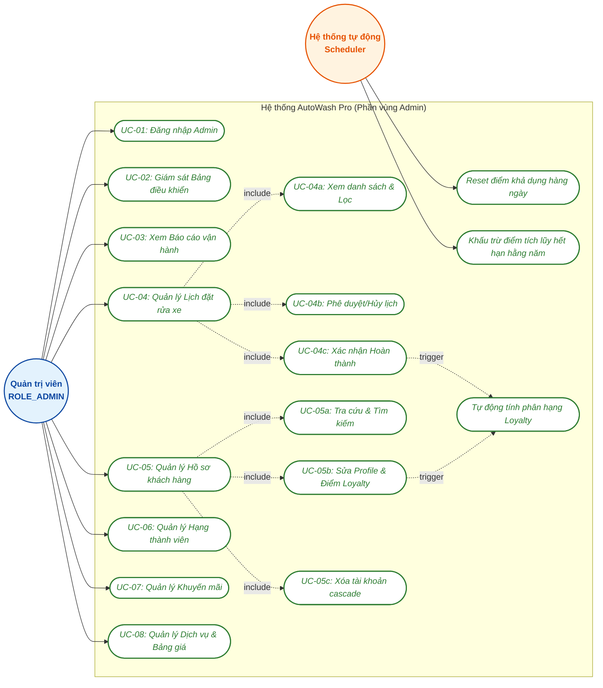
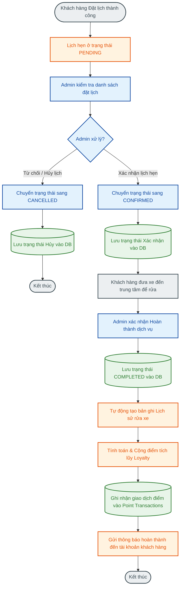
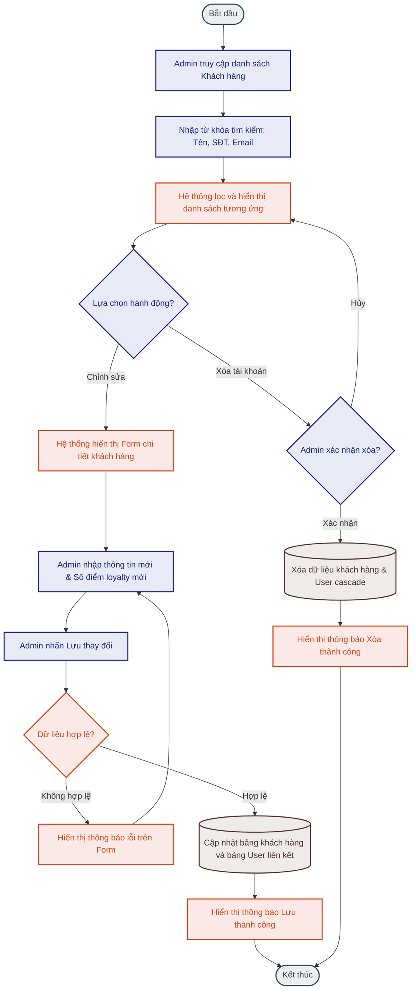
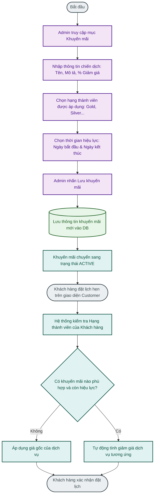
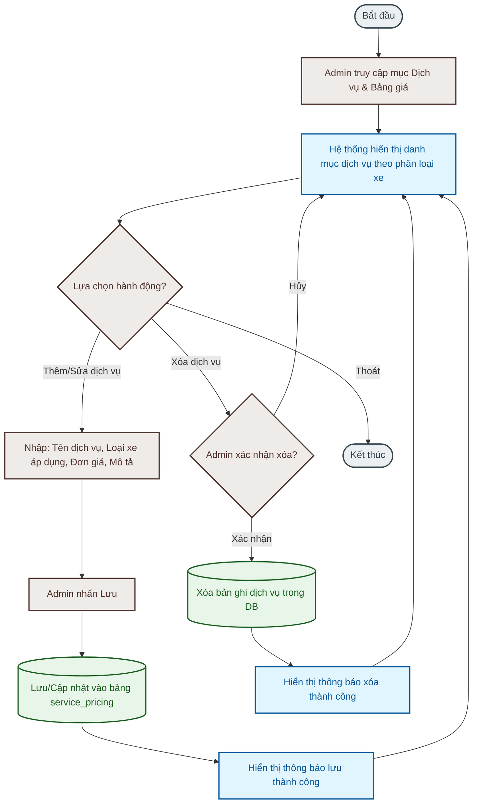

# TÀI LIỆU ĐẶC TẢ USE CASE CỦA QUẢN TRỊ VIÊN (ADMIN) - AUTOWASH PRO

Tài liệu này đặc tả chi tiết các Use Case dành cho vai trò **Quản trị viên (Admin)** trong hệ thống quản lý và vận hành rửa xe tự động **AutoWash Pro**. Tài liệu được xây dựng trực tiếp dựa trên mã nguồn cấu hình Spring Security, các RestController, Service, và Repository hiện hành của dự án.

---

## 1. TỔNG QUAN HỆ THỐNG & CƠ CHẾ PHÂN QUYỀN

### A. Phân quyền truy cập (Access Control)
Hệ thống sử dụng **Spring Security** (cấu hình chi tiết tại [SecurityConfig.java](file:///d:/HeThongQuanLyRuaXeTuDong/src/main/java/com/autowash/config/SecurityConfig.java)) để bảo vệ tài nguyên:
*   Các đường dẫn dành riêng cho Admin bao gồm: `/admin/**` và `/api/admin/**`. Hệ thống kiểm tra và chỉ cho phép người dùng có quyền `ROLE_ADMIN` truy cập.
*   Khi người dùng đăng nhập thành công tại đường dẫn `/login`, `DashboardController` sẽ đánh giá quyền của phiên làm việc hiện tại:
    *   Nếu người dùng có quyền `ROLE_ADMIN` -> Điều hướng về `/admin/dashboard`.
    *   Nếu người dùng có quyền `ROLE_CUSTOMER` -> Điều hướng về `/customer/dashboard`.

### B. Môi trường và Ràng buộc Dữ liệu
*   Mật khẩu của quản trị viên được mã hóa một chiều qua thuật toán **BCrypt**.
*   Các thay đổi về trạng thái, điểm số, và giao dịch khuyến mãi sẽ lập tức được lưu vào cơ sở dữ liệu MySQL và được đồng bộ hiển thị lên bảng điều khiển của Admin cũng như giao diện của khách hàng tương ứng.

---

## 2. SƠ ĐỒ HỆ THỐNG USE CASE CỦA ADMIN (UML USE CASE DIAGRAM)

Dưới đây là sơ đồ UML Use Case biểu diễn mối quan hệ giữa các tác nhân (Admin, Hệ thống tự động) và các Use Case chức năng/phi chức năng tương ứng trong hệ thống AutoWash Pro:




---

## 3. ĐẶC TẢ CHI TIẾT TỪNG USE CASE

### UC-01: Đăng nhập Quản trị viên (Admin Login)
*   **Tác nhân:** Quản trị viên.
*   **Mô tả:** Admin đăng nhập bằng tài khoản được cấp quyền quản trị để truy cập trang quản lý.
*   **Điều kiện tiên quyết:** Tài khoản Admin có tồn tại trong bảng `users` với `role = ROLE_ADMIN`.
*   **Điều kiện sau:** Lưu thông tin phiên làm việc vào Spring Security context, chuyển hướng thành công đến `/admin/dashboard`.
*   **Luồng sự kiện chính:**
    1.  Admin truy cập vào trang đăng nhập `/login` (Template [login.html](file:///d:/HeThongQuanLyRuaXeTuDong/src/main/resources/templates/auth/login.html)).
    2.  Admin điền thông tin đăng nhập bao gồm: Email (Username) và Mật khẩu.
    3.  Admin nhấn nút **Đăng nhập**.
    4.  Hệ thống xử lý xác thực: So khớp thông tin đăng nhập và kiểm tra mật khẩu đã được mã hóa bằng BCrypt.
    5.  Xác thực thành công, hệ thống chuyển hướng Admin tới `/dashboard` rồi tiếp tục điều hướng về `/admin/dashboard`.
*   **Luồng ngoại lệ:**
    *   *Sai thông tin đăng nhập:* Hệ thống chuyển hướng trở lại `/login?error=true` và thông báo lỗi.
*   **Sơ đồ UML Use Case chi tiết của UC-01 (Admin Login):**
    ```mermaid
    graph TB
        %% Styles
        classDef actorNode fill:#e3f2fd,stroke:#0d47a1,stroke-width:2px,color:#0d47a1,font-weight:bold;
        classDef ucNode fill:#ffffff,stroke:#2e7d32,stroke-width:2px,color:#2e7d32,font-style:italic;
        classDef sysNode fill:#fff3e0,stroke:#e65100,stroke-width:2px,color:#e65100,font-weight:bold;

        %% Actors
        Admin((Quản trị viên<br/>ROLE_ADMIN)):::actorNode
        SpringSecurity((Spring Security<br/>System)):::sysNode

        subgraph "Hệ thống Phân vùng Xác thực (Auth Subsystem)"
            %% Main Use Case
            UC_Login([UC-01: Đăng nhập Admin]):::ucNode
            
            %% Fine-grained Use Cases
            UC_Input([UC-01.1: Nhập Email & Mật khẩu]):::ucNode
            UC_Auth([UC-01.2: Xác thực & So khớp mật khẩu]):::ucNode
            UC_Redirect([UC-01.3: Điều hướng theo vai trò ROLE_ADMIN]):::ucNode
            UC_Error([UC-01.4: Hiển thị thông báo lỗi]):::ucNode
            UC_Remember([UC-01.5: Ghi nhớ đăng nhập]):::ucNode
            
            %% Relationships
            UC_Login -.->|include| UC_Input
            UC_Login -.->|include| UC_Auth
            UC_Login -.->|include| UC_Redirect
            
            UC_Auth -.->|extend| UC_Error
            UC_Login -.->|extend| UC_Remember
        end

        %% Associations
        Admin --> UC_Login
        SpringSecurity --> UC_Auth
        SpringSecurity --> UC_Redirect
    ```

---

### UC-02: Giám sát Bảng điều khiển (Dashboard Monitoring)
*   **Tác nhân:** Quản trị viên.
*   **Mô tả:** Admin xem tổng quan số liệu thống kê doanh thu và tình hình hoạt động của trung tâm.
*   **Điều kiện tiên quyết:** Đăng nhập thành công với quyền `ROLE_ADMIN`.
*   **Luồng sự kiện chính:**
    1.  Admin truy cập vào menu **Dashboard** (`/admin/dashboard`).
    2.  `AdminPageController.dashboard()` tiếp nhận yêu cầu và gọi `DashboardService` truy vấn dữ liệu từ DB:
        *   Doanh thu thực tế (chỉ tính lịch đặt xe trạng thái `COMPLETED`).
        *   Tổng hợp số lượng lịch đặt xe theo trạng thái (`PENDING`, `CONFIRMED`...).
        *   Tổng số lượng khách hàng đã đăng ký sử dụng dịch vụ.
    3.  Hệ thống truyền các biến dữ liệu tương ứng (`summary`, `bookingStats`, `customerStats`) vào Spring Model.
    4.  Giao diện được render thông qua template [dashboard.html](file:///d:/HeThongQuanLyRuaXeTuDong/src/main/resources/templates/admin/dashboard.html).
*   **Sơ đồ UML Use Case chi tiết của UC-02:**
    ```mermaid
    graph TB
        %% Styles
        classDef actorNode fill:#e3f2fd,stroke:#0d47a1,stroke-width:2px,color:#0d47a1,font-weight:bold;
        classDef ucNode fill:#ffffff,stroke:#2e7d32,stroke-width:2px,color:#2e7d32,font-style:italic;
        classDef sysNode fill:#fff3e0,stroke:#e65100,stroke-width:2px,color:#e65100,font-weight:bold;

        %% Actors
        Admin((Quản trị viên<br/>ROLE_ADMIN)):::actorNode
        DB[(Cơ sở dữ liệu MySQL)]:::sysNode

        subgraph "Hệ thống Bảng điều khiển (Dashboard Subsystem)"
            UC_Dash([UC-02: Giám sát Bảng điều khiển]):::ucNode
            UC_Rev([UC-02.1: Xem doanh thu thực tế]):::ucNode
            UC_Stats([UC-02.2: Xem thống kê trạng thái đặt lịch]):::ucNode
            UC_Cust([UC-02.3: Xem số lượng khách hàng đăng ký]):::ucNode
            
            UC_Dash -.->|include| UC_Rev
            UC_Dash -.->|include| UC_Stats
            UC_Dash -.->|include| UC_Cust
        end

        Admin --> UC_Dash
        UC_Rev --> DB
        UC_Stats --> DB
        UC_Cust --> DB
    ```

---

### UC-03: Xem Báo cáo vận hành (Operational Reports)
*   **Tác nhân:** Quản trị viên.
*   **Mô tả:** Admin xem báo cáo tài chính và hoạt động chi tiết để hỗ trợ việc đưa ra các quyết định vận hành.
*   **Điều kiện tiên quyết:** Đăng nhập thành công với quyền `ROLE_ADMIN`.
*   **Luồng sự kiện chính:**
    1.  Admin nhấn chọn menu **Báo cáo** (`/admin/reports`).
    2.  `AdminPageController.reports()` gọi `DashboardService` để kết xuất doanh thu thực tế và thống kê phân phối booking.
    3.  Dữ liệu được chuyển qua Model thông qua biến `summary` và `bookingStats`.
    4.  Hệ thống hiển thị giao diện qua template [reports.html](file:///d:/HeThongQuanLyRuaXeTuDong/src/main/resources/templates/admin/reports.html).
*   **Sơ đồ UML Use Case chi tiết của UC-03:**
    ```mermaid
    graph TB
        %% Styles
        classDef actorNode fill:#e3f2fd,stroke:#0d47a1,stroke-width:2px,color:#0d47a1,font-weight:bold;
        classDef ucNode fill:#ffffff,stroke:#2e7d32,stroke-width:2px,color:#2e7d32,font-style:italic;

        %% Actors
        Admin((Quản trị viên<br/>ROLE_ADMIN)):::actorNode

        subgraph "Hệ thống Báo cáo (Reports Subsystem)"
            UC_Rep([UC-03: Xem Báo cáo vận hành]):::ucNode
            UC_Fin([UC-03.1: Xem số liệu tài chính]):::ucNode
            UC_Status([UC-03.2: Xem biểu đồ trạng thái đặt chỗ]):::ucNode
            
            UC_Rep -.->|include| UC_Fin
            UC_Rep -.->|include| UC_Status
        end

        Admin --> UC_Rep
    ```

---

### UC-04: Quản lý Lịch đặt rửa xe (Manage Bookings)
*   **Tác nhân:** Quản trị viên, Hệ thống.
*   **Mô tả:** Admin theo dõi toàn bộ danh sách đặt lịch hẹn, thực hiện tìm kiếm, lọc và cập nhật trạng thái lịch rửa xe.
*   **Điều kiện tiên quyết:** Đăng nhập thành công với quyền `ROLE_ADMIN`.
*   **Điều kiện sau:** Trạng thái đặt lịch cập nhật thành công, tự động cộng điểm thưởng cho khách hàng nếu dịch vụ hoàn thành.
*   **Luồng sự kiện chính:**
    1.  Admin truy cập trang **Đặt lịch** (`/admin/bookings`).
    2.  Admin có thể tìm kiếm theo tên/SĐT khách hàng hoặc lọc danh sách theo trạng thái (`status`).
    3.  `AdminPageController.bookings()` lọc danh sách:
        *   Nếu tìm kiếm theo khách hàng: Tìm ID khách hàng qua `customerService.searchCustomers()`, sau đó lấy booking của các khách hàng này.
        *   Nếu lọc theo trạng thái: Gọi `bookingService.getBookingsByStatus()`.
    4.  Admin tiến hành thay đổi trạng thái của một lịch hẹn:
        *   *Xác nhận:* Chuyển từ `PENDING` thành `CONFIRMED`.
        *   *Hủy lịch:* Chuyển thành `CANCELLED`.
        *   *Hoàn thành:* Chuyển thành `COMPLETED`.
    5.  Hệ thống gửi POST tới `/admin/bookings/{id}/status`.
    6.  `BookingService.updateBookingStatus(id, status)` kiểm tra:
        *   Nếu trạng thái cũ không phải `COMPLETED` và trạng thái mới chuyển sang là `COMPLETED`: Hệ thống tự động gọi `loyaltyService.addPoints(customerId, 200, "Hoàn thành đặt lịch")` để cộng **200 điểm tích lũy** (loyalty) và **200 điểm khả dụng** (redeemable) cho khách hàng, đồng thời tạo giao dịch điểm loại `EARN`.
    7.  Hệ thống cập nhật thời gian thay đổi và lưu vào bảng `bookings`.
    8.  Hệ thống gửi thông báo động về tài khoản khách hàng thông qua danh sách thông báo.
*   **Luồng ngoại lệ:**
    *   *Không tìm thấy lịch đặt:* Hệ thống ném ra `RuntimeException` và hiển thị thông báo lỗi nếu ID không tồn tại.
*   **Sơ đồ UML Use Case chi tiết của UC-04:**
    ```mermaid
    graph TB
        %% Styles
        classDef actorNode fill:#e3f2fd,stroke:#0d47a1,stroke-width:2px,color:#0d47a1,font-weight:bold;
        classDef ucNode fill:#ffffff,stroke:#2e7d32,stroke-width:2px,color:#2e7d32,font-style:italic;
        classDef sysNode fill:#fff3e0,stroke:#e65100,stroke-width:2px,color:#e65100,font-weight:bold;

        %% Actors
        Admin((Quản trị viên<br/>ROLE_ADMIN)):::actorNode
        System((Hệ thống tự động)):::sysNode

        subgraph "Hệ thống Quản lý Đặt lịch (Booking Subsystem)"
            UC_Book([UC-04: Quản lý Lịch đặt rửa xe]):::ucNode
            UC_View([UC-04a: Xem & Lọc lịch đặt]):::ucNode
            UC_Status([UC-04b: Cập nhật trạng thái đặt lịch]):::ucNode
            UC_Delete([UC-04c: Xóa lịch đặt]):::ucNode
            
            UC_Points([UC-04.1: Cộng 200 điểm Loyalty]):::ucNode
            UC_History([UC-04.2: Lưu Lịch sử rửa xe]):::ucNode
            UC_Notify([UC-04.3: Gửi thông báo động]):::ucNode

            UC_Book -.->|include| UC_View
            UC_Book -.->|include| UC_Status
            UC_Book -.->|include| UC_Delete
            
            UC_Status -.->|extend| UC_Points
            UC_Status -.->|extend| UC_History
            UC_Status -.->|extend| UC_Notify
        end

        Admin --> UC_Book
        System --> UC_Points
        System --> UC_Notify
    ```

---

### UC-05: Quản lý Hồ sơ khách hàng (Manage Customers)
*   **Tác nhân:** Quản trị viên.
*   **Mô tả:** Admin tìm kiếm, chỉnh sửa hồ sơ khách hàng (bao gồm việc can thiệp cộng/trừ điểm thưởng thủ công) hoặc xóa tài khoản.
*   **Điều kiện tiên quyết:** Đăng nhập thành công với quyền `ROLE_ADMIN`.
*   **Luồng sự kiện chính (Xem & Sửa):**
    1.  Admin truy cập vào menu **Khách hàng** (`/admin/customers`). Admin có thể tìm kiếm bằng từ khóa `q` (Họ tên, SĐT, Email hoặc ID).
    2.  Hệ thống hiển thị danh sách qua template [customers.html](file:///d:/HeThongQuanLyRuaXeTuDong/src/main/resources/templates/admin/customers.html).
    3.  Admin chọn khách hàng và nhấn **Sửa** -> Hệ thống chuyển hướng tới form chỉnh sửa `/admin/customers/{id}/edit` (Template [customer-edit.html](file:///d:/HeThongQuanLyRuaXeTuDong/src/main/resources/templates/admin/customer-edit.html)).
    4.  Admin cập nhật các thông tin liên hệ và số điểm (`loyaltyPoints`, `redeemablePoints`) rồi nhấn **Lưu**.
    5.  `customerService.updateProfile(id, customer)` lưu các thông tin mới vào bảng `customers` và tự động cập nhật thời gian sửa đổi.
*   **Luồng sự kiện chính (Xóa tài khoản):**
    1.  Admin nhấn **Xóa** tài khoản khách hàng trên danh sách.
    2.  Hệ thống gửi POST tới `/admin/customers/{id}/delete`.
    3.  `customerService.deleteCustomer(id)` thực hiện xóa:
        *   Tìm ID tài khoản người dùng (`userId`) liên kết.
        *   Xóa tài khoản đăng nhập trong bảng `users` (`userRepository.deleteById(userId)`).
        *   Xóa hồ sơ khách hàng tương ứng (`customerRepository.deleteById(id)`).
    4.  Redirect về trang danh sách kèm thông báo thành công.
*   **Luồng ngoại lệ:**
    *   *Email trùng lặp hoặc không hợp lệ:* Nếu sửa email thành một email đã tồn tại trong DB, hệ thống sẽ báo lỗi.
*   **Sơ đồ UML Use Case chi tiết của UC-05:**
    ```mermaid
    graph TB
        %% Styles
        classDef actorNode fill:#e3f2fd,stroke:#0d47a1,stroke-width:2px,color:#0d47a1,font-weight:bold;
        classDef ucNode fill:#ffffff,stroke:#2e7d32,stroke-width:2px,color:#2e7d32,font-style:italic;

        %% Actors
        Admin((Quản trị viên<br/>ROLE_ADMIN)):::actorNode

        subgraph "Hệ thống Quản lý Khách hàng (Customer Subsystem)"
            UC_Cust([UC-05: Quản lý Hồ sơ khách hàng]):::ucNode
            UC_Search([UC-05a: Tra cứu & Tìm kiếm]):::ucNode
            UC_Edit([UC-05b: Chỉnh sửa Profile & Điểm loyalty]):::ucNode
            UC_Delete([UC-05c: Xóa tài khoản khách hàng]):::ucNode
            UC_Cascade([UC-05.1: Xóa Cascade User liên kết]):::ucNode

            UC_Cust -.->|include| UC_Search
            UC_Cust -.->|include| UC_Edit
            UC_Cust -.->|include| UC_Delete
            
            UC_Delete -.->|include| UC_Cascade
        end

        Admin --> UC_Cust
    ```

---

### UC-06: Quản lý Hạng thành viên (Manage Loyalty Tiers)
*   **Tác nhân:** Quản trị viên.
*   **Mô tả:** Admin cấu hình các cấp hạng thành viên và các ưu đãi tương ứng để kích thích chi tiêu.
*   **Điều kiện tiên quyết:** Đăng nhập thành công với quyền `ROLE_ADMIN`.
*   **Luồng sự kiện chính:**
    1.  Admin truy cập menu **Loyalty** (`/admin/loyalty`).
    2.  Hệ thống hiển thị danh sách hạng thành viên hiện tại được sắp xếp theo mức điểm tăng dần (`loyaltyService.getAllTiers()`).
    3.  Admin điền thông tin vào form tạo hạng mới: Tên hạng, Điểm tối thiểu, Điểm tối đa (nếu có), Phần trăm giảm giá ưu đãi.
    4.  Admin nhấn **Tạo hạng** -> Gửi POST tới `/admin/loyalty`. `loyaltyService.createTier(tier)` lưu hạng mới vào bảng `loyalty_tiers`.
    5.  Để xóa một hạng, Admin nhấn **Xóa** bên cạnh phân hạng tương ứng -> Gửi POST tới `/admin/loyalty/{id}/delete`.
*   **Sơ đồ UML Use Case chi tiết của UC-06:**
    ```mermaid
    graph TB
        %% Styles
        classDef actorNode fill:#e3f2fd,stroke:#0d47a1,stroke-width:2px,color:#0d47a1,font-weight:bold;
        classDef ucNode fill:#ffffff,stroke:#2e7d32,stroke-width:2px,color:#2e7d32,font-style:italic;

        %% Actors
        Admin((Quản trị viên<br/>ROLE_ADMIN)):::actorNode

        subgraph "Hệ thống Hạng thành viên (Loyalty Subsystem)"
            UC_Loy([UC-06: Quản lý Hạng thành viên]):::ucNode
            UC_View([UC-06a: Xem danh sách hạng]):::ucNode
            UC_Create([UC-06b: Thêm mới hạng loyalty]):::ucNode
            UC_Delete([UC-06c: Xóa hạng loyalty]):::ucNode

            UC_Loy -.->|include| UC_View
            UC_Loy -.->|include| UC_Create
            UC_Loy -.->|include| UC_Delete
        end

        Admin --> UC_Loy
    ```

---

### UC-07: Quản lý Chiến dịch khuyến mãi (Manage Promotions)
*   **Tác nhân:** Quản trị viên.
*   **Mô tả:** Admin thiết lập các chương trình khuyến mãi giảm giá áp dụng theo từng hạng thành viên trong các khoảng thời gian nhất định.
*   **Điều kiện tiên quyết:** Đăng nhập thành công với quyền `ROLE_ADMIN`.
*   **Luồng sự kiện chính:**
    1.  Admin truy cập trang **Khuyến mãi** (`/admin/promotions`).
    2.  Admin điền form tạo khuyến mãi mới: Tên chiến dịch, Mô tả, Hạng thành viên áp dụng (`tierName`), % giảm giá, Ngày bắt đầu, Ngày kết thúc, và Trạng thái kích hoạt.
    3.  Admin nhấn **Tạo khuyến mãi** -> Gửi POST tới `/admin/promotions`. `promotionService.createPromotion(promotion)` lưu chiến dịch vào bảng `promotions`.
    4.  Admin có thể đảo trạng thái kích hoạt của chiến dịch bằng cách nhấn **Đổi trạng thái** -> Gửi POST tới `/admin/promotions/{id}/toggle`.
    5.  Admin xóa chiến dịch bằng cách nhấn **Xóa** -> Gửi POST tới `/admin/promotions/{id}/delete`.
*   **Sơ đồ UML Use Case chi tiết của UC-07:**
    ```mermaid
    graph TB
        %% Styles
        classDef actorNode fill:#e3f2fd,stroke:#0d47a1,stroke-width:2px,color:#0d47a1,font-weight:bold;
        classDef ucNode fill:#ffffff,stroke:#2e7d32,stroke-width:2px,color:#2e7d32,font-style:italic;

        %% Actors
        Admin((Quản trị viên<br/>ROLE_ADMIN)):::actorNode

        subgraph "Hệ thống Khuyến mãi (Promotion Subsystem)"
            UC_Promo([UC-07: Quản lý Chiến dịch khuyến mãi]):::ucNode
            UC_Create([UC-07a: Tạo khuyến mãi theo hạng]):::ucNode
            UC_Toggle([UC-07b: Đổi trạng thái Toggle Active]):::ucNode
            UC_Delete([UC-07c: Xóa chương trình khuyến mãi]):::ucNode

            UC_Promo -.->|include| UC_Create
            UC_Promo -.->|include| UC_Toggle
            UC_Promo -.->|include| UC_Delete
        end

        Admin --> UC_Promo
    ```

---

### UC-08: Quản lý Dịch vụ & Đơn giá (Manage Service Pricing)
*   **Tác nhân:** Quản trị viên.
*   **Mô tả:** Admin thiết lập bảng giá dịch vụ rửa xe phân loại theo loại phương tiện.
*   **Điều kiện tiên quyết:** Đăng nhập thành công với quyền `ROLE_ADMIN`.
*   **Luồng sự kiện chính:**
    1.  Admin truy cập vào trang **Dịch vụ** (`/admin/services`).
    2.  Hệ thống hiển thị danh sách dịch vụ hiện hành (Tải từ `pricingService.getAllServices()`).
    3.  Admin điền form thêm mới hoặc chỉnh sửa: Tên dịch vụ, Loại xe áp dụng (Sedan, SUV, Truck...), Đơn giá (VND), Mô tả.
    4.  Admin nhấn **Lưu dịch vụ** -> Gửi POST tới `/admin/services`.
    5.  `pricingService.saveService(service)` lưu hoặc cập nhật dịch vụ vào bảng `service_pricing`.
    6.  Để xóa dịch vụ, Admin nhấn **Xóa** bên cạnh gói dịch vụ -> Gửi POST tới `/admin/services/{id}/delete`.
*   **Sơ đồ UML Use Case chi tiết của UC-08:**
    ```mermaid
    graph TB
        %% Styles
        classDef actorNode fill:#e3f2fd,stroke:#0d47a1,stroke-width:2px,color:#0d47a1,font-weight:bold;
        classDef ucNode fill:#ffffff,stroke:#2e7d32,stroke-width:2px,color:#2e7d32,font-style:italic;

        %% Actors
        Admin((Quản trị viên<br/>ROLE_ADMIN)):::actorNode

        subgraph "Hệ thống Dịch vụ & Bảng giá (Service Subsystem)"
            UC_Serv([UC-08: Quản lý Dịch vụ & Đơn giá]):::ucNode
            UC_View([UC-08a: Xem danh mục dịch vụ]):::ucNode
            UC_Save([UC-08b: Cấu hình thêm/sửa dịch vụ]):::ucNode
            UC_Delete([UC-08c: Xóa gói dịch vụ]):::ucNode

            UC_Serv -.->|include| UC_View
            UC_Serv -.->|include| UC_Save
            UC_Serv -.->|include| UC_Delete
        end

        Admin --> UC_Serv
    ```

---

## 4. CÁC QUY TẮC NGHIỆP VỤ CỐT LÕI (BUSINESS RULES)

### A. Quy tắc Tích lũy Điểm
*   Đơn hàng rửa xe hoàn thành lần đầu tiên (`PENDING` -> `COMPLETED`) sẽ tự động cộng **200 điểm** vào tổng điểm tích lũy (`loyalty_points`) và điểm khả dụng (`redeemable_points`) của khách hàng.
*   Hệ thống ghi nhận giao dịch cộng điểm này vào bảng `point_transactions` dưới dạng giao dịch loại `EARN`.

### B. Quy tắc Quy đổi Điểm Loyalty
*   Khách hàng có quyền dùng điểm khả dụng (`redeemable_points`) để quy đổi phần thưởng/giảm giá.
*   **Chống lạm dụng quy đổi:** Hệ thống kiểm tra giao dịch quy đổi gần nhất trong bảng `point_transactions`. Nếu giao dịch quy đổi (`REDEEM`) gần nhất cách thời điểm hiện tại **chưa đầy 30 ngày**, hệ thống sẽ từ chối giao dịch mới và báo lỗi: *"Bạn đã đổi điểm trong 30 ngày gần đây. Vui lòng thử lại sau."*
*   Số điểm quy đổi yêu cầu không được vượt quá số điểm khả dụng hiện có của khách hàng.

### C. Quy tắc Thu hồi & Hết hạn Điểm Tự động (Scheduled Tasks)
1.  **Reset điểm do không hoạt động (Inactivity Points Reset):**
    *   Hằng ngày vào lúc **03:00 sáng**, hệ thống chạy scheduled task quét toàn bộ khách hàng.
    *   Nếu một khách hàng **không có bất kỳ lịch đặt rửa xe nào trong vòng 30 ngày qua**, toàn bộ số điểm khả dụng (`redeemable_points`) của họ sẽ bị reset về **0**. Hệ thống ghi nhận giao dịch trừ điểm loại `EXPIRE`.
2.  **Hết hạn điểm tích lũy theo năm (Yearly Points Expiration):**
    *   Hệ thống tự động quét và thu hồi các khoản điểm tích lũy loại `EARN` đã nhận từ hơn **12 tháng trước** ra khỏi tổng điểm tích lũy xếp hạng (`loyalty_points`).

### D. Quy tắc Phân hạng Thành viên Tự động
*   Khi có bất kỳ thay đổi điểm tích lũy nào, hệ thống tự động chạy phương thức `determineTier(points)` so khớp tổng điểm tích lũy hiện có của khách hàng với thang điểm `minPoints` và `maxPoints` được quy định trong bảng `loyalty_tiers` để tự động nâng/hạ hạng thành viên tương ứng (Bronze, Silver, Gold, Platinum).

---

## 5. SƠ ĐỒ LUỒNG HOẠT ĐỘNG CHI TIẾT (ACTIVITY FLOWS)

### Quy trình Phê duyệt & Hoàn thành Đặt lịch (UC-04 Flow)


### Quy trình Quản lý Khách hàng & Điều chỉnh Điểm Loyalty (UC-05 Flow)


### Quy trình Thiết lập & Áp dụng Khuyến mãi theo hạng thành viên (UC-07 Flow)


### Quy trình Quản lý Dịch vụ & Bảng giá (UC-08 Flow)

